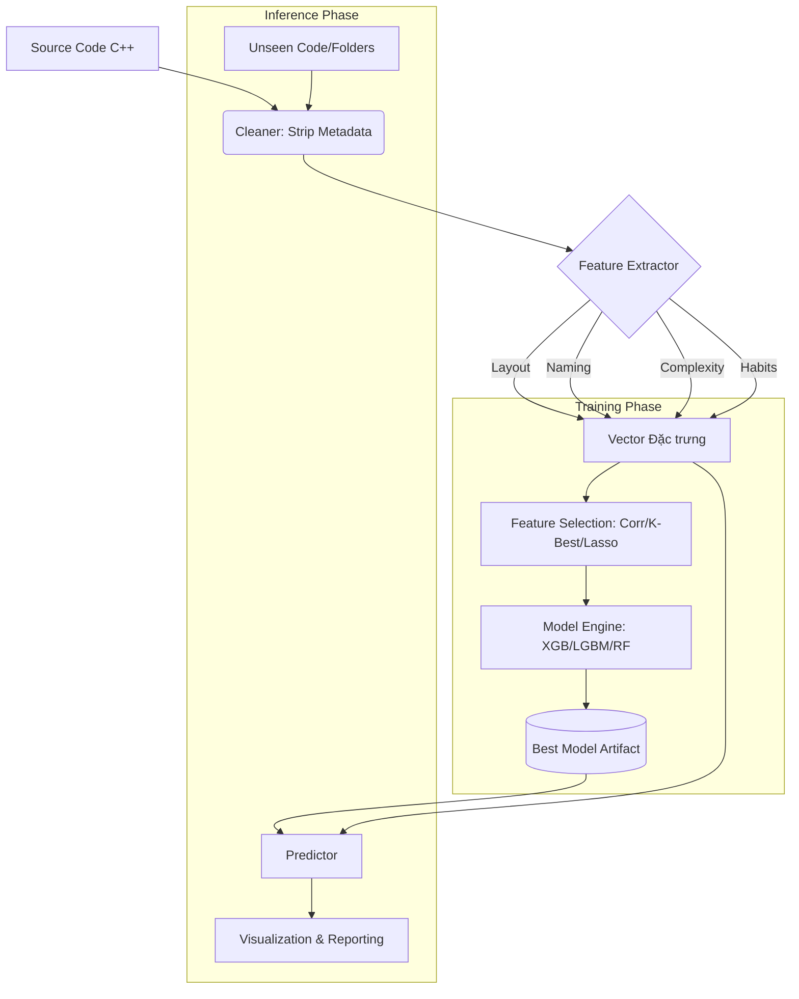

# AI Code Detection System - Master Documentation

## 1. System Overview & Context
Hệ thống này được thiết kế để phân loại mã nguồn C++ là do **Con người (Human)** hay **Trí tuệ nhân tạo (AI)** tạo ra. 
Dựa trên phân tích file `extracted_with_markdown.py`, hệ thống sử dụng phương pháp trích xuất đặc trưng tĩnh (Static Feature Extraction) kết hợp với các mô hình Machine Learning mạnh mẽ (XGBoost, LightGBM, Random Forest) để đưa ra quyết định.

**Mục tiêu chính:** 
- Trích xuất 32+ đặc trưng định lượng từ mã nguồn (bố cục, đặt tên, độ phức tạp, thói quen lập trình).
- Loại bỏ nhiễu và leakage từ metadata do AI sinh ra.
- Huấn luyện mô hình có khả năng tổng quát hóa cao, chống overfit.
- Cung cấp công cụ inference mạnh mẽ trên quy mô lớn (hàng trăm ngàn file).

## 2. Proposed Project Structure (Architecture Tree)
Để chuyển đổi từ một script nguyên khối sang hệ thống chuyên nghiệp, chúng tôi đề xuất cấu trúc Modular Architecture như sau:

```text
ai_code_detection/
├── 00_README_MASTER.md          # Tài liệu tổng quan hệ thống
├── core/
│   ├── feature_extractor/       # Module cốt lõi trích xuất đặc trưng
│   │   ├── extractor_SPEC.md
│   │   └── extractor_SRS.md
│   └── logic/                   # Thuật toán Halstead, Entropy, Lizard
├── data/
│   ├── pipeline/                # Module xử lý dữ liệu & Feature Selection
│   │   ├── pipeline_SPEC.md
│   │   └── pipeline_SRS.md
│   └── loaders/                 # Loader cho JSONL, ZIP
├── models/
│   ├── engine/                  # Module huấn luyện & Quản lý Model
│   │   ├── engine_SPEC.md
│   │   └── engine_SRS.md
│   └── zoo/                     # Lưu trữ trọng số model (.json, .pkl)
├── inference/
│   ├── reporter/                # Module dự đoán & Báo cáo kết quả
│   │   ├── reporter_SPEC.md
│   │   └── reporter_SRS.md
│   └── scanner/                 # Quét thư mục đệ quy
└── utils/
    ├── shared/                  # Công cụ bổ trợ (Logging, Zip, Config)
    │   ├── shared_SPEC.md
    │   └── shared_SRS.md
    └── cleaning/                # Strip Metadata Headers
```

**Lý do thiết kế:**
- **Separation of Concerns:** Tách biệt logic trích xuất (Core) khỏi logic huấn luyện (Models) và logic thực thi (Inference).
- **Scalability:** Dễ dàng thêm các loại đặc trưng mới hoặc các kiến trúc model mới mà không ảnh hưởng luồng cũ.
- **Maintainability:** Giảm Technical Debt của file script dài 1000+ dòng, dễ dàng unit test từng phần.

## 3. Data Flow & Pipeline


## 4. Global Data Contracts
**Input Schema (JSONL):**
```json
{
  "code": "string (C++ source code)",
  "label": "string ('AI' or 'Human')"
}
```

**Feature Vector Schema (32 Dimensions):**
- Layout: `comment_ratio`, `empty_line_ratio`, `avg_line_length`, etc.
- Naming: `avg_identifier_length`, `single_char_var_ratio`, etc.
- Complexity: `cyclomatic_complexity`, `halstead_volume`, `maintainability_index`, etc.
- Habits: `has_bits_stdc`, `modern_cpp_ratio`, `has_fast_io`, etc.
- Entropy: `shannon_entropy`, `whitespace_entropy`.

## 5. Architect's Review
**Technical Debt hiện tại:**
- **Monolithic Script:** Toàn bộ logic từ cài đặt lib, trích xuất, huấn luyện đến trực quan hóa nằm chung một chỗ, gây khó khăn cho việc đóng gói và deploy.
- **Hardcoded Paths:** Các đường dẫn file Google Drive đang được code cứng.
- **Complexity Dependency:** Phụ thuộc vào thư viện `lizard` bên ngoài, cần cơ chế handle khi parse lỗi.

**Giải pháp với Kiến trúc mới:**
- **Module hóa:** Tách biệt hoàn toàn, cho phép chạy Inference độc lập mà không cần code huấn luyện.
- **Config-driven:** Sử dụng file cấu trúc để quản lý đường dẫn và tham số hyper-parameter.
- **Robustness:** Thêm các lớp Exception Handling cho quá trình đọc file và trích xuất đặc trưng.
