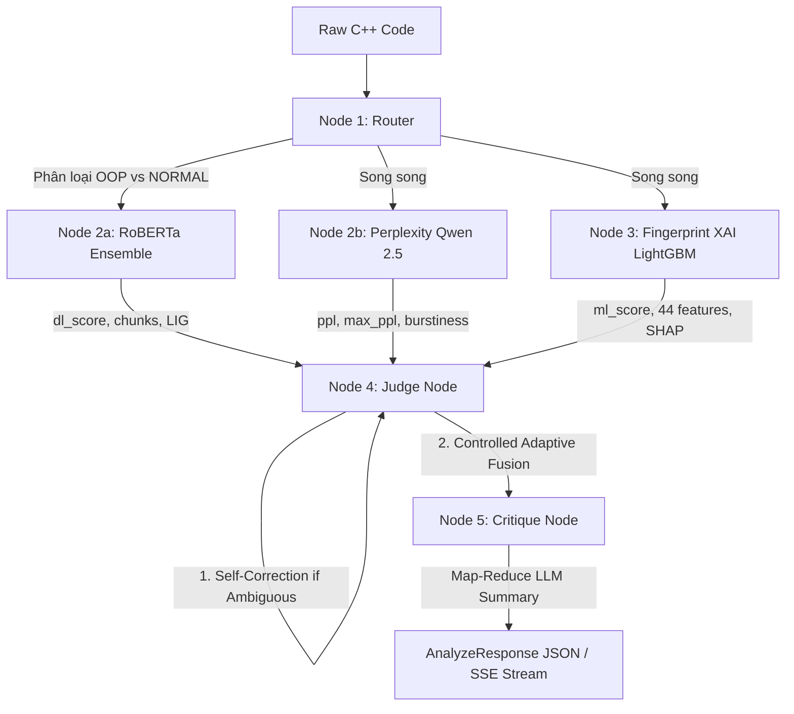

# 🕵️‍♂️ C++ AI Code Detector — Enterprise Backend & MLOps Platform

<p align="center">
  
  
  
  
  
  
  
  
</p>

---

## 📖 Tổng Quan Dự Án

**C++ AI Code Detector** là nền tảng Backend & MLOps cấp doanh nghiệp phục vụ bài toán phát hiện mã nguồn C++ do **Trí tuệ nhân tạo sinh ra (AI-Generated)** hay do **Con người viết (Human-Written)**. 

Hệ thống kết hợp sức mạnh của **Deep Learning** (RoBERTa/GraphCodeBERT Ensemble), **Mô hình Ngôn ngữ Lớn** (vLLM Qwen 2.5 Coder 7B), **Machine Learning truyền thống** (LightGBM trên 44 static code features) và cơ chế **Giải thích nhân quả (Explainable AI - XAI)** thông qua SHAP & Layer Integrated Gradients (LIG).

### 🎯 Input & Output Cốt Lõi

| Loại dữ liệu | Định dạng | Mô tả ví dụ |
|---|---|---|
| **Input** | Raw C++ Code (Base64-encoded) | `#include <iostream>\nint main() { ... }` |
| **Output** | JSON Payload & SSE Event Stream | Điểm số AI Score, Nhãn phân loại, Điểm Perplexity, Token Attributions & XAI Fingerprint |

---

## 🏛️ Kiến Trúc Hệ Thống (System Architecture)

Hệ thống được xây dựng dựa trên 2 nguyên lý kiến trúc nòng cốt:

### 1. Kiến Trúc Hybrid Cloud-Local (Tối ưu hóa VRAM)
Các model Deep Learning và LLM yêu cầu từ **14–16GB VRAM**, vượt quá khả năng phần cứng thông thường của máy tính cá nhân. Do đó, hệ thống được phân tách thành:
- **Local Machine:** Chạy Django Web, MLOps Admin Dashboard, FastAPI Orchestrator, PostgreSQL, Redis, Redpanda và Celery Worker.
- **Cloud GPU Runtime (Google Colab hoặc Local GPU Server):** Chạy RoBERTa Ensemble, trích xuất attribution LIG và vLLM Qwen 2.5 Coder, kết nối an toàn về Local qua đường hầm **ngrok**.

```text
┌────────────────────────────────────────────────────────────────────────┐
│                     🖥️ LOCAL MACHINE (Laptop / PC)                     │
│                                                                        │
│  ┌─────────────────────────┐   ┌─────────────────┐  ┌────────────────┐ │
│  │   🌐 DJANGO WEB APP     │   │  Redis Broker   │  │ Celery Workers │ │
│  │   (Auth, Submission,    │   │  & Redpanda     │  │ (Async ETL,    │ │
│  │    Admin Dashboard)     │   │                 │  │  S3 Push)      │ │
│  └────────────┬────────────┘   └────────┬────────┘  └───────┬────────┘ │
│               │                         │                   │          │
│               └────────────────┬────────┴───────────────────┘          │
│                                │                                       │
│  ┌─────────────────────────┐   │  PostgreSQL (Gold Data) ◄──┘          │
│  │ ⚡ FASTAPI ORCHESTRATOR  │◄──┘                                       │
│  │    (Port 8001)          │            DagsHub S3 (Data Lake) ──┐     │
│  └────────────┬────────────┘                                     │     │
└───────────────┼──────────────────────────────────────────────────│─────┘
                │ HTTPS (ngrok tunnel) hoặc localhost:8002          │
                ▼                                                  │
┌──────────────────────────────────────────────────────────────────│─────┐
│             ☁️ GPU RUNTIME (Google Colab hoặc Local GPU)          │     │
│                                                                  │     │
│  ┌────────────────────────────────────────────────────────────┐  │     │
│  │  🔧 GPU INFERENCE SERVER                                    │  │     │
│  │  • RoBERTa Ensemble K-Fold (OOP vs Normal)                 │  │     │
│  │  • Layer Integrated Gradients (LIG Attribution)            │  │     │
│  │  • vLLM Qwen 2.5 Coder 7B (Perplexity & Critique)          │  │     │
│  └────────────────────────────────────────────────────────────┘  │     │
└──────────────────────────────────────────────────────────────────│─────┘
                                                                   │
       DVC / MLflow Tracking ◄─────────────────────────────────────┘
```

### 2. Kiến Trúc Dữ Liệu 3 Tầng (Medallion Data Architecture)
- **🥉 Bronze Layer (PostgreSQL & DagsHub S3):** Lưu trữ mã nguồn thô kèm metadata dưới dạng JSONL.
- **🥈 Silver Layer (DagsHub S3):** Lưu đặc trưng đã trích xuất (44 static features cho ML và 512 tokens cho DL) dưới dạng `.parquet` phục vụ Retraining.
- **🥇 Gold Layer (PostgreSQL):** Lưu kết quả dự đoán (Predictions, SHAP Values, Token Attributions) phục vụ phân tích trên MLOps Dashboard.

---

## 🤖 Quy Trình Suy Luận AI 5 Giai Đoạn (LangGraph Pipeline)

Mỗi đoạn mã C++ gửi tới `/api/analyze_stream` sẽ trải qua quy trình đánh giá 5 giai đoạn nghiêm ngặt:



1. **Node ① Router:** Kết hợp Heuristic regex và LLM để phân loại mã nguồn C++ thành `OOP` hoặc `NORMAL`, tự động chọn đúng model checkpoint chuyên biệt.
2. **Node ②a Analyzer (RoBERTa Ensemble):** Phân tích mã nguồn theo từng chunk 512 token, áp dụng Layer Integrated Gradients (LIG) tính độ ảnh hưởng của từng từ khóa C++.
3. **Node ②b Perplexity Engine (vLLM Qwen):** Tính toán Perplexity, Max PPL và Burstiness để xác định độ bất ngờ và tính đa dạng trong hành văn code.
4. **Node ③ Fingerprint XAI (LightGBM + SHAP):** Trích xuất 44 đặc trưng tĩnh (Halstead, Cyclomatic Complexity, Phong cách đặt tên, Thói quen lập trình hiện đại C++) và tính SHAP values giải thích đặc trưng.
5. **Node ④ Judge (Self-Correction & Adaptive Fusion):** 
   - *Tự sửa lỗi (Self-Correction):* Thử lại model đối nghịch nếu kết quả rơi vào vùng phân vân (0.40 - 0.60) hoặc xung đột PPL.
   - *Hợp nhất thích ứng (Controlled Adaptive Fusion):* Điều chỉnh điểm số theo trọng số $0.70 \cdot DL + 0.30 \cdot ML$ khi xuất hiện xung đột nhãn giữa Deep Learning và Machine Learning.
6. **Node ⑤ Critique (LLM Map-Reduce):** Đánh giá chi tiết từng chunk và tổng hợp phân tích toàn cục qua chuỗi fallback: Qwen 2.5 Coder ➔ Gemini ➔ OpenAI.

---

## 💻 Tech Stack

| Thành phần | Công nghệ | Vai trò & Mục đích |
|---|---|---|
| **Web Frontend & Admin** | Django 5.x + Django ORM + Tailwind/Vanilla CSS | Xác thực User, Giao diện nộp bài, Admin Command Center (6 views) |
| **AI Orchestration** | FastAPI (Async) + Pydantic v2 + SSE | Tiếp nhận request, điều phối pipeline AI non-blocking, stream realtime |
| **Deep Learning** | PyTorch + HuggingFace (RoBERTa / GraphCodeBERT) | Mô hình Ensemble phân loại token sequence |
| **Machine Learning** | LightGBM + Scikit-Learn | Phân loại dựa trên 44 static code features |
| **LLM & Inference** | vLLM + Qwen 2.5 Coder 7B | Tính toán Perplexity và tạo giải thích critique chuyên sâu |
| **Explainable AI (XAI)**| SHAP + Captum (LIG) | Trực quan hóa heatmap token và xếp hạng feature quan trọng |
| **Message Broker** | Redis + Redpanda (Kafka compatible) | Quản lý Celery task queue và event streaming bất đồng bộ |
| **Background Jobs** | Celery 5.x | Xử lý ETL Medallion và đồng bộ dữ liệu S3 Data Lake |
| **Database** | PostgreSQL 16 | Lưu trữ ACID, metadata submissions và gold predictions |
| **Data Lake & Tracking**| DagsHub S3 + DVC + MLflow | Quản lý dataset Parquet và lưu vết huấn luyện lại model |

---

## 🚀 Hướng Dẫn Cài Đặt & Chạy Hệ Thống

### 1. Yêu Cầu Tiên Quyết
- Hệ điều hành: Linux / macOS / Windows (WSL2 hoặc PowerShell)
- Python 3.10+ hoặc Conda / Miniconda
- Docker & Docker Compose

### 2. Thiết Lập Môi Trường
```bash
# Clone repository
git clone https://github.com/your-username/cpp-ai-code-detector.git
cd cpp-ai-code-detector

# Tạo môi trường ảo (khuyên dùng Conda)
conda create -n detection_ai python=3.11 -y
conda activate detection_ai

# Cài đặt dependencies
pip install -r requirements.txt

# Thiết lập file cấu hình môi trường
cp .env.example .env
# (Mở file .env và cập nhật API Key hoặc các cổng kết nối nếu cần)
```

### 3. Khởi Động Infrastructure (Database & Brokers)
```bash
docker-compose up -d
```
*Kiểm tra: 3 container `postgres`, `redis`, `redpanda` đang ở trạng thái `Up (healthy)`.*

### 4. Thiết Lập GPU Worker (Google Colab hoặc Local GPU)
- **Phương án A: Dùng Google Colab (GPU T4/L4 miễn phí - Khuyên dùng)**:
  1. Mở Google Colab, cấu hình Runtime chọn **T4 GPU**.
  2. Tải thư mục `src/colab_runtime/` lên Colab.
  3. Chạy lệnh: `python bootstrap.py`.
  4. Copy đường dẫn ngrok URL in ra ở màn hình Colab (ví dụ: `https://xxxx-xxxx.ngrok-free.dev`).
  5. Cập nhật vào `.env`: `FASTAPI_AI_URL=https://xxxx-xxxx.ngrok-free.dev`.
- **Phương án B: Dùng Local GPU Server (Nếu máy có GPU rời NVIDIA)**:
  1. Chạy server tại port 8002: `uvicorn src.local_gpu_server.main:app --port 8002`
  2. Cập nhật vào `.env`: `FASTAPI_AI_URL=http://localhost:8002`.

### 5. Khởi Động Toàn Bộ Dịch Vụ
Trên Linux / macOS:
```bash
# Khởi chạy toàn bộ 4 Pane (FastAPI, Django, Celery, GPU Server) trong 1 phiên Tmux
chmod +x dev.sh
./dev.sh
```

Hoặc chạy thủ công trên 3 Terminal riêng biệt:
```bash
# Terminal 1: FastAPI Orchestrator
uvicorn src.fastapi_service.main:app --port 8001

# Terminal 2: Django Web App & Dashboard
python manage.py migrate
python manage.py runserver 8000

# Terminal 3: Celery Background Worker
celery -A src.celery_workers.celery_app worker --loglevel=info
```

---

## 🔗 Danh Sách Đường Dẫn (System Endpoints & Sitemap)

### 👤 User Portal (`http://localhost:8000`)
| Đường dẫn | Trang giao diện | Chức năng |
|---|---|---|
| `/accounts/login/` | 🔐 Đăng nhập | Đăng nhập tài khoản hệ thống |
| `/accounts/register/` | 📝 Đăng ký | Tạo tài khoản người dùng mới |
| `/accounts/profile/` | ⚙️ Cài đặt | Quản lý hồ sơ cá nhân và API tokens |
| `/submit/` | 🧬 Phân tích Code | Giao diện chính dán hoặc tải lên mã nguồn C++ |
| `/submit/history/` | 📂 Lịch sử nộp | Xem lại các lượt phân tích trước đây |
| `/submit/result/<hash>/` | 📊 Chi tiết kết quả | Báo cáo chi tiết AI score, heatmap attribution, XAI |

### 🛡️ Admin Command Center (`http://localhost:8000/dashboard/`)
*(Yêu cầu tài khoản có quyền `is_staff=True`)*
| Đường dẫn | Trang quản trị | Nội dung giám sát |
|---|---|---|
| `/dashboard/` | 📡 Live Monitoring | Thẻ KPI tổng quan, sơ đồ Medallion realtime, tỷ lệ AI/Human |
| `/dashboard/metrics/` | 📈 Metrics Chuyên sâu | Biểu đồ Chart.js độ trễ suy luận, VRAM, phân bổ độ tin cậy |
| `/dashboard/infra/` | 🏗️ Infrastructure | Kiểm tra tình trạng sức khỏe thực tế của 6 microservices |
| `/dashboard/database/` | 🗄️ Database Submissions | Bảng dữ liệu toàn bộ submissions và bộ lọc |
| `/dashboard/users/` | 👥 Quản lý Người dùng | Danh sách user, phân quyền Access Matrix |
| `/dashboard/models/` | 🤖 Model Registry | Thông tin model active, VRAM tiêu thụ, lịch sử retraining |

### ⚡ FastAPI AI Service (`http://localhost:8001`)
| Endpoint | Method | Mô tả chức năng |
|---|---|---|
| `/health` | `GET` | Kiểm tra trạng thái runtime, latency P95, VRAM stats |
| `/docs` | `GET` | Giao diện Swagger UI tương tác trực tiếp với API |
| `/api/analyze` | `POST` | Phân tích mã nguồn đồng bộ (Synchronous) |
| `/api/analyze_stream` | `POST` | Phân tích mã nguồn qua Server-Sent Events (Realtime Streaming) |

---

## 📁 Cấu Trúc Thư Mục Chuẩn Hóa

```text
.
├── .env.example                  # Template cấu hình môi trường mẫu
├── .gitignore                    # Bộ lọc git chuẩn (bảo mật secrets, data rác)
├── Makefile                      # Lệnh tắt tiện ích (make dev, make test)
├── README.md                     # Tài liệu tổng thể dự án
├── app.py                        # Streamlit web view (test nhanh streaming)
├── dev.sh                        # Script khởi động 1 lệnh đa nhiệm qua Tmux
├── docker-compose.yml            # Khởi tạo PostgreSQL, Redis, Redpanda
├── manage.py                     # Django entrypoint
├── pytest.ini                    # Cấu hình test runner
├── requirements.txt              # Danh mục dependencies Python
│
├── notebooks/                    # Jupyter Notebooks nghiên cứu thuật toán
│   ├── feature_extraction.ipynb  # Thử nghiệm trích xuất 44 đặc trưng C++
│   ├── graphcodebert_baseline.ipynb # Huấn luyện mô hình GraphCodeBERT
│   └── hybrid_model.ipynb        # Thử nghiệm mô hình Hybrid Fusion
│
├── src/                          # Mã nguồn chính của hệ thống
│   ├── celery_workers/           # Tác vụ nền ETL (Bronze -> Silver -> Gold)
│   ├── colab_runtime/            # GPU Worker đóng gói chạy trên Google Colab
│   ├── data_pipeline/            # Logic chuyển đổi dữ liệu và Retraining
│   ├── django_web/               # Ứng dụng Web Django & Admin Dashboard
│   ├── fastapi_service/          # FastAPI Orchestrator & AI LangGraph Engine
│   ├── local_gpu_server/         # Server nạp RoBERTa chạy trên GPU local
│   ├── local_gpu_agent/          # Module trích xuất đặc trưng bổ trợ
│   └── shared/                   # Config, Database session, Data contracts
│
├── tests/                        # Toàn bộ Unit, Integration & E2E Tests
└── data_lake/                    # Thư mục lưu trữ dữ liệu local mô phỏng
    ├── bronze/                   # Chứa .gitkeep
    ├── silver/                   # Chứa .gitkeep
    └── gold/                     # Chứa .gitkeep
```

---

## 🧪 Kiểm Thử Hệ Thống (Testing)

Dự án bao gồm đầy đủ các bộ kiểm thử tự động từ mức đơn vị đến kiểm thử tích hợp:

```bash
# Chạy toàn bộ test suites
pytest

# Chạy riêng kiểm thử luồng AI Orchestrator
pytest tests/fastapi_service/

# Chạy kiểm thử Web App và Database Models
pytest tests/django_web/
```

---

## 📜 Giấy Phép (License)
Dự án được phát triển phục vụ đề tài Luận Văn Tốt Nghiệp (LVTN). Mã nguồn được chia sẻ vì mục đích học thuật và nghiên cứu.
